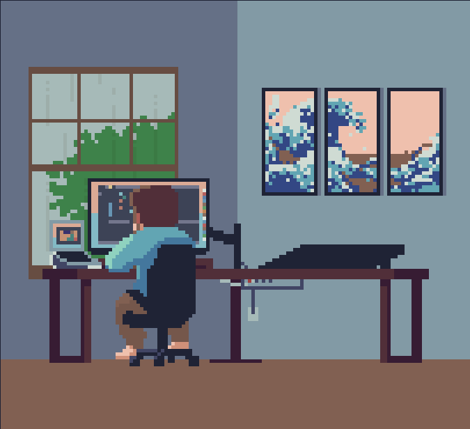

<h2> Hi, I'm Eduardo</h2>

  
  
  
  

Welcome to my github!  I'm Eduardo, Fullstack developer and mobile developer from  Mexico City.

<h3 align="center" >Things I code with</h3>

  
  
  
  
  
  
  
  
  
  
  
  
  
  
  
  
  
  
  
  
  
  
  

<h3 align="left">About me</h3>
<table style="width: 100%; border-collapse: collapse;">
  <tr>
    <td style="vertical-align: top; width: 60%; padding: 10px;">
      

        I started programming at the age of 14; my first programming language was Visual Basic. Currently, my main focus is the development of web, mobile, and artificial intelligence applications. In my GitHub account, you can find projects related to these areas, as well as some experiments and tests I've done. I hope you like them, and if you have any suggestions or comments, don't hesitate to contact me!
      

    </td>
    <td style="text-align: center; width: 40%; padding: 10px;">
      
    </td>
  </tr>
</table>
<!-- 

  

 -->

<!-- 
 -->
<!--    -->
<!-- 
 -->
<!-- <h3 align="center">Featured Repositories</h3> -->
<!--  -->
<!-- 
In this section you can find my featured repositories, that is, those projects that I have worked on and that I consider especially relevant or interesting. Here you can explore the source code of my projects and learn more about the technologies and tools that I have used in each of them. I hope you find something you like and find useful!
 -->
<!--  -->
<!-- 
 -->
<!--   <a href="https://github.com/EddyBel/Implementacion-de-red-neuronal-para-la-clasificacion-de-puntos-en-un-plano" > -->
<!--      -->
<!--   </a> -->
<!--   <a href="https://github.com/EddyBel/My-personal-api"> -->
<!--       -->
<!--   </a> -->
<!-- 
 -->
<!--  -->
<!-- 
 -->
<!-- <a href="https://github.com/EddyBel/Portafolio-Web" > -->
<!--      -->
<!--   </a> -->
<!--   <a href="https://github.com/EddyBel/Notebook" > -->
<!--       -->
<!--   </a> -->
<!-- 
 -->
